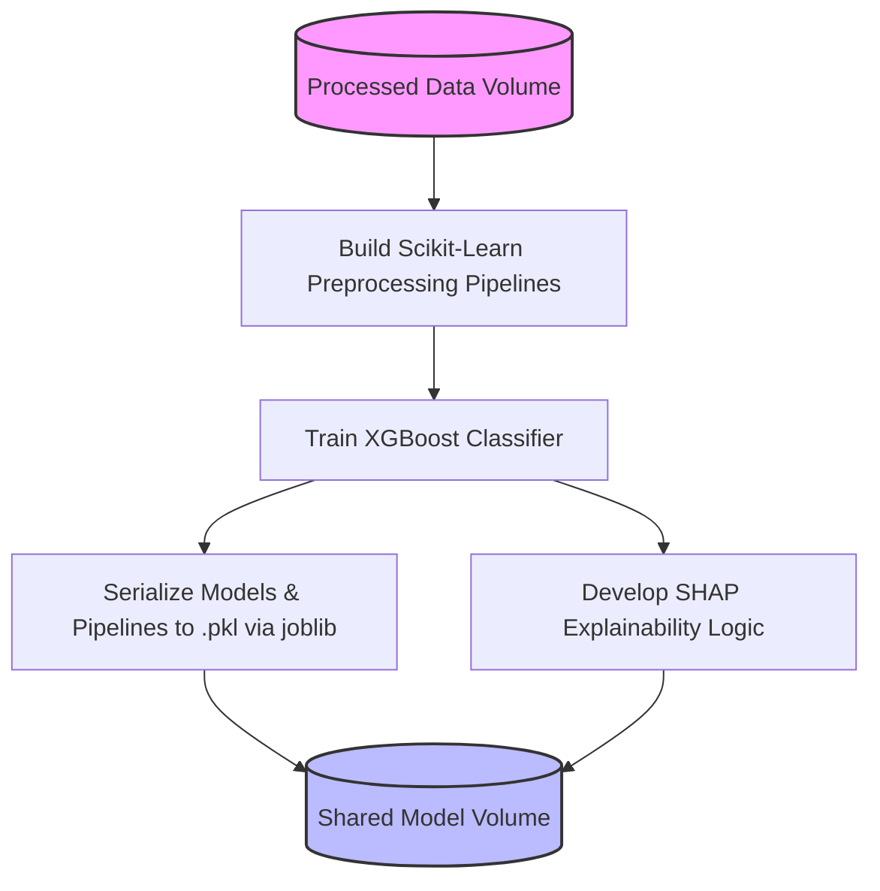

### Data Pipeline & Architecture

# AI Customer Retention Intelligence

## Overview
The objective of this project is to develop a customer intelligence platform driven by artificial intelligence. This platform is designed to flag customers who are at risk of leaving and provide clear explanations for their potential churn. By combining machine learning, customer segmentation, and AI-driven insights, the solution predicts customer attrition and clarifies the core drivers behind it.

## Problem Statement
Subscription-based businesses face the daily challenge of customer loss. Product and business teams frequently struggle to determine:
* Which specific users are most likely to cancel their subscriptions?
* What distinct customer profiles or segments exist within the user base?
* What specific actions or behaviors signal an impending churn?
* Which users should the business prioritize when launching retention campaigns?

## Data Sources
TBD

## Methodology

### 0. Optional Customer Segmentation (Unsupervised Learning)
* **Algorithm:** KMeans Clustering.
* **Objective:** Identify and group users based on shared behavioral traits.
* **Target Segments:** Power Users, Loyal Customers, Low Engagement Users, and At-Risk Customers.

### 1. Churn Prediction Pipeline (Supervised Learning)
* **Input Data:** Subscription details, behavioral logs, satisfaction scores, and revenue metrics.
* **Target:** Predicting the likelihood of churn.
* **Evaluated Models:** Logistic Regression, Random Forest, and XGBoost.

### 2. Explainability and AI Integration
* **Model Interpretation:** Extracting feature importance to understand the weight of different variables (with optional SHAP value integration).
* **AI Business Explanations:** The system translates model outputs into readable, natural language insights. For a given Customer ID, the output includes their assigned segment, the probability of them leaving, and a summary of risk factors (e.g., highlighting that low engagement or high support ticket volumes are the primary drivers).

## Business Value
This tool directly empowers business and product teams to make data-backed retention decisions. It shifts the approach from reactive to proactive by clearly identifying at-risk users, mapping out behavioral segments, and explaining the 'why' behind the churn risk.

## Future Roadmap
Planned enhancements following the initial development phase include:
* Development of an interactive Power BI Dashboard for stakeholder reporting.
* In-depth Cohort Analysis.
* Advanced Retention Analytics.
* Implementation of a Lightweight Analytics Agent.
