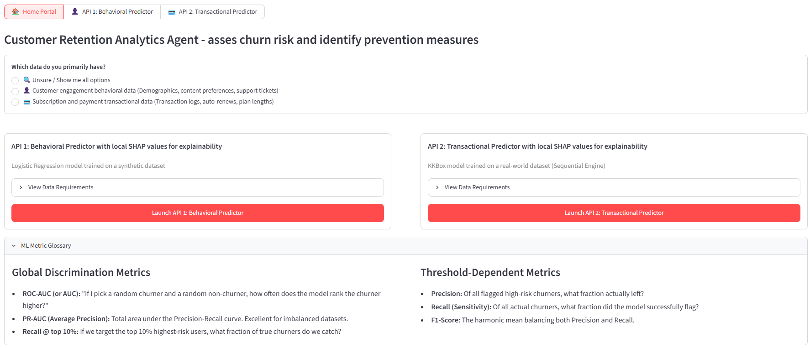
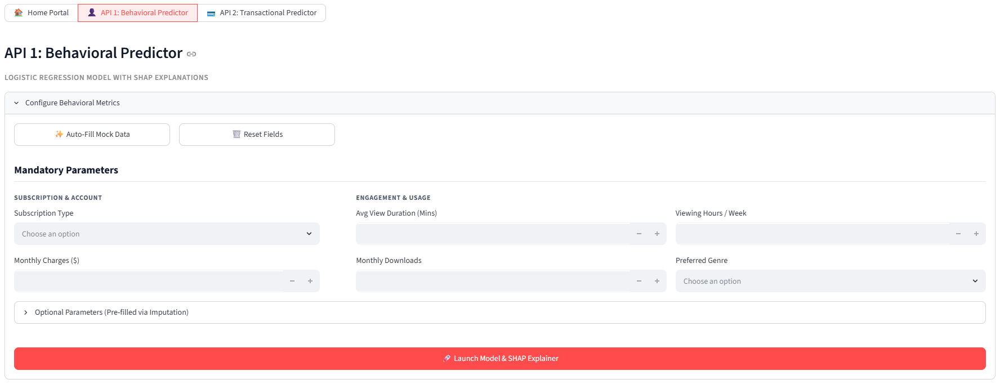
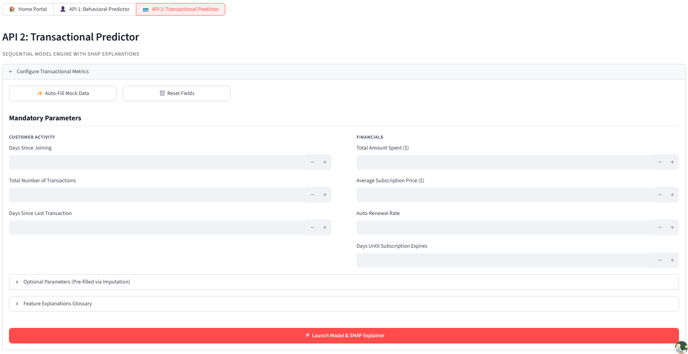
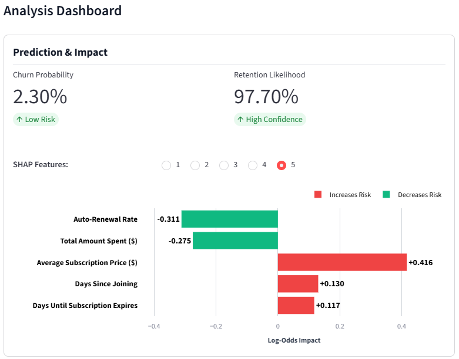
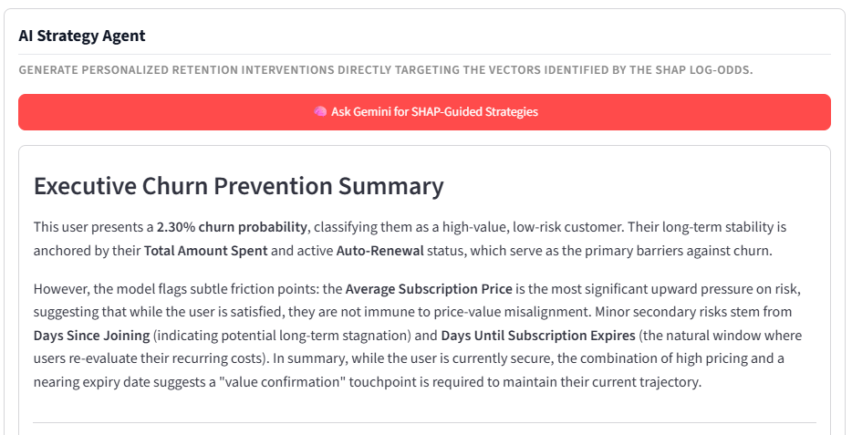
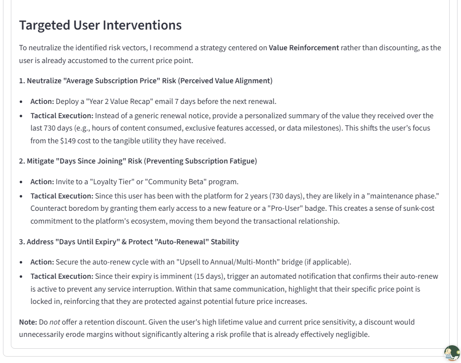

### Data Pipeline & Architecture

# Intelligent Customer Retention Agent

## Overview

The **Intelligent Customer Retention Agent** is an AI-powered decision support platform designed to help subscription-based businesses identify customers who are at risk of churning before they leave.

The platform combines **machine learning**, **explainable AI**, and **generative AI** to not only predict customer churn, but also explain the factors driving each prediction and generate personalized retention recommendations.

To support different business environments, the platform provides two independent prediction engines:

- **Behavioral Predictor** – Designed for businesses with customer engagement and usage data.
- **Transactional Predictor** – Designed for businesses with subscription and payment history.

Both prediction engines provide:

- Customer churn probability
- SHAP-based model explanations
- AI-generated retention strategies powered by Google Gemini
- Interactive Streamlit web application
- FastAPI backend for scalable model deployment

The goal of the Intelligent Customer Retention Agent is to transform customer data into actionable business insights, enabling organizations to move from **reactive customer retention** to **proactive, data-driven decision making**.

## Problem Statement

Customer churn is one of the biggest challenges for subscription-based businesses. Acquiring a new customer is often significantly more expensive than retaining an existing one, making early identification of at-risk customers critical.

Many organizations collect large amounts of customer data but struggle to answer key business questions, such as:

- Which customers are most likely to churn?
- Which customer behaviors indicate an increased churn risk?
- Why is a particular customer predicted to leave?
- Which customers should be prioritized for retention campaigns?
- What actions can be taken to improve customer retention?

The challenge is further complicated by the fact that different businesses have access to different types of customer data. Some organizations primarily collect customer engagement and behavioral information, while others maintain detailed subscription and transaction histories.

The **Intelligent Customer Retention Agent** addresses this challenge by providing two specialized prediction engines, allowing businesses to generate accurate churn predictions using the data they already possess while providing transparent explanations and AI-generated retention strategies.

## Features

- 🤖 Two specialized customer churn prediction engines
- 📊 Interactive Streamlit web application
- ⚡ FastAPI backend for scalable deployment
- 🌳 Multiple machine learning models evaluated
- 🔍 SHAP-based explainability for every prediction
- ✨ AI-generated retention strategies using Google Gemini
- 🐳 Dockerized application for reproducible deployment

## Live Demo

- **Application:** https://retention-agent-lewagon.streamlit.app/
- **Backend Repository:** https://github.com/Soodabeh/retention-agent
- **Frontend Repository:** https://github.com/annamorgiel/frontend-retention-agent

## Demo

### Homepage

---

### Behavioral Predictor

---

### Transactional Predictor

---

### SHAP Explainability

---

### Gemini Summary

---

### Gemini Recommendations

## Architecture

Streamlit Frontend
                        │
                        ▼
            FastAPI Backend (Cloud Run)
                        │
        ┌───────────────┴───────────────┐
        ▼                               ▼
 Behavioral Predictor           Transactional Predictor
 (Logistic Regression)              (LightGBM)
        │                               │
        └───────────────┬───────────────┘
                        ▼
              SHAP Explainability
                        │
                        ▼
        Gemini Retention Recommendations

## Data Sources

The Intelligent Customer Retention Agent supports two independent prediction pipelines, each trained on a different customer churn dataset.

### API 1 – Behavioral Predictor

The Behavioral Predictor is trained on a customer subscription and engagement dataset containing anonymized user information, including:

- Subscription plan and billing information
- Customer viewing behavior
- Content preferences
- Support interactions
- Device usage
- Customer satisfaction ratings

This dataset represents businesses that primarily collect **customer engagement and behavioral data**. It enables the model to identify churn patterns based on how customers interact with a subscription service.

**Target Variable**

- `Churn` (Binary classification)

---

### API 2 – Transactional Predictor (KKBox)

The Transactional Predictor is trained using the **KKBox WSDM Churn Prediction Challenge** dataset, a real-world music streaming subscription dataset.

Rather than relying on customer preferences, this dataset focuses on **subscription and payment history**, including:

- Membership information
- Subscription transactions
- Payment history
- Auto-renewal behavior
- Membership expiry dates
- Cancellation history

The original dataset consists of multiple relational tables (`members`, `transactions`, and `train`) which were merged and transformed through feature engineering into a customer-level machine learning dataset.

The engineered features include:

- Customer tenure
- Days since last transaction
- Days until subscription expiry
- Auto-renewal rate
- Total amount spent
- Average subscription price
- Number of previous cancellations
- Number of transactions

**Target Variable**

- `is_churn` (Binary classification)

A customer is considered to have churned if they **do not renew their subscription within 30 days after their membership expires**, rather than simply cancelling their subscription.

---

### Why Two Prediction Engines?

Different businesses collect different types of customer data.

Instead of forcing every company to use the same model, this project provides two specialized prediction engines:

| API | Primary Data Available | Final Model |
|------|------------------------|-------------|
| Behavioral Predictor | Customer engagement and usage data | Logistic Regression |
| Transactional Predictor | Subscription and payment history | LightGBM |

This allows organizations to obtain accurate churn predictions using the customer information they already possess.

## Methodology

The Intelligent Customer Retention Agent consists of two independent machine learning pipelines, each designed for a different type of customer data.

### API 1 – Behavioral Predictor

- **Dataset:** Customer engagement and subscription behavior data
- **Preprocessing:** Missing value imputation, feature encoding, scaling, and train/test split
- **Models Evaluated:** Logistic Regression, Random Forest, XGBoost
- **Final Model:** **Logistic Regression**

### API 2 – Transactional Predictor

- **Dataset:** KKBox WSDM Churn Prediction Challenge
- **Feature Engineering:** Customer-level features created from subscription and transaction history
- **Models Evaluated:** Logistic Regression, Random Forest, Balanced Random Forest, XGBoost, LightGBM
- **Final Model:** **LightGBM**

### Explainability

Both prediction engines provide local explanations using **SHAP (SHapley Additive exPlanations)**. These explanations are passed to **Google Gemini**, which generates personalized customer retention strategies in natural language.

## Model Performance

The final production models were selected based on their performance on unseen test data.

| Prediction Engine | Final Model | ROC-AUC | PR-AUC | Recall |
|-------------------|-------------|:------:|:------:|:------:|
| Behavioral Predictor | Logistic Regression | **0.75** | **-** | **0.70** |
| Transactional Predictor | LightGBM | **0.892** | **0.532** | **0.263** |

### Evaluation Metrics

- **ROC-AUC:** Measures how well the model distinguishes between customers who churn and those who remain subscribed.
- **PR-AUC:** Measures model performance on the minority (churn) class and is particularly informative for imbalanced datasets.
- **Recall:** Measures the proportion of actual churning customers correctly identified by the model.

## Business Value

The Intelligent Customer Retention Agent helps subscription-based businesses transform customer data into actionable retention insights.

By combining machine learning, explainable AI, and generative AI, the platform enables organizations to:

- Identify customers who are most likely to churn before they leave.
- Understand the key factors driving each churn prediction through SHAP explainability.
- Generate personalized, AI-powered retention strategies using Google Gemini.
- Prioritize customer retention efforts based on predicted churn risk.
- Make faster, more informed, and data-driven business decisions.

Rather than reacting after customers have already left, businesses can proactively intervene, improve customer retention, and maximize customer lifetime value.

## Tech Stack

The Intelligent Customer Retention Agent was developed using the following technologies:

| Category | Technologies |
|----------|--------------|
| **Programming Language** | Python |
| **Data Processing** | Pandas, NumPy |
| **Machine Learning** | Scikit-learn, XGBoost, LightGBM |
| **Explainable AI** | SHAP |
| **Generative AI** | Google Gemini |
| **Backend API** | FastAPI |
| **Frontend** | Streamlit |
| **Deployment** | Docker |
| **Model Serialization** | Joblib |
| **Version Control** | Git & GitHub |

## Future Roadmap
Potential future enhancements to the Intelligent Customer Retention Agent include:

- Integration with Customer Relationship Management (CRM) systems such as Salesforce or HubSpot.
- Real-time churn prediction using live customer data.
- Automated model monitoring and periodic retraining pipelines.
- Additional industry-specific prediction engines for sectors beyond subscription services.
- Personalized retention recommendations based on historical campaign effectiveness.
- Support for Customer Lifetime Value (CLV) prediction alongside churn prediction.
- Enhanced business dashboards and analytics for customer retention monitoring.

## Contributors

This project was developed as part of the Le Wagon Data Science & AI Bootcamp by:

- **Charlotte Welge** ([@SchottiW](https://github.com/SchottiW))
- **Soodabeh Bahrekazemi** ([@Soodabeh](https://github.com/Soodabeh))
- **Anna Morgiel** ([@annamorgiel](https://github.com/annamorgiel))
- **Natalia Zargaran** ([@nykucherenko-gif](https://github.com/nykucherenko-gif))
