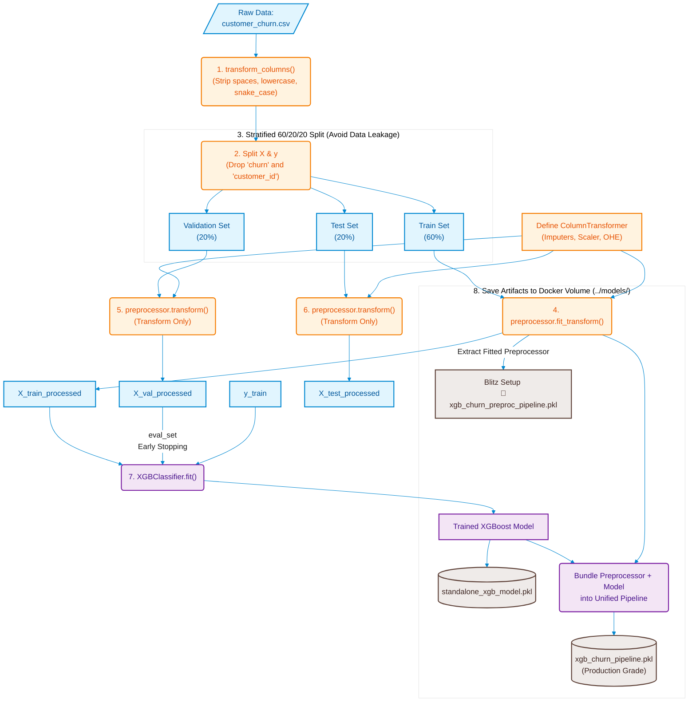

Training & Serialization Pipeline



Evaluation & Inference Pipeline
```mermaid
graph TD
    %% Base Styling
    classDef data fill:#e1f5fe,stroke:#0288d1,stroke-width:2px,color:#01579b;
    classDef process fill:#fff3e0,stroke:#f57c00,stroke-width:2px,color:#e65100;
    classDef storage fill:#efebe9,stroke:#5d4037,stroke-width:2px,color:#3e2723;
    classDef approachA fill:#e8f5e9,stroke:#388e3c,stroke-width:2px,color:#1b5e20;
    classDef approachB fill:#fffde7,stroke:#fbc02d,stroke-width:2px,color:#f57f17;

    %% Raw Input
    A[/"Fresh Evaluation Data:<br>validation_data.csv"/]:::data --> B("1. transform_columns()<br>(Must match Notebook 1 string modifications)"):::process
    B --> C("2. Extract X & y<br>(Drop 'churn' and 'customer_id')"):::process
    C --> X_raw["X_val_raw"]:::data
    C --> y_raw["y_val_raw<br>(Ground Truth Labels)"]:::data

    %% Branching Logic
    X_raw --> Choice{"Choose Processing<br>& Prediction Strategy"}

    %% Strategy A
    subgraph Strategy_A ["Approach A: The Production Way"]
        Choice -->|Pass Raw Columns| M3[("xgb_churn_pipeline.pkl")]:::storage
        M3 --> Run_A("pipeline.predict(X_val_raw)<br>(Internal transformation & scaling)"):::approachA
        Run_A --> Y_Pred_A["y_pred / y_prob"]:::data
    end

    %% Strategy B
    subgraph Strategy_B ["Approach B: The Modular Way (Debugging)"]
        Choice -->|Pass to Separated Picker| M2[("xgb_churn_preproc_pipeline.pkl")]:::storage
        M2 --> Run_B1("preprocessor.transform(X_val_raw)<br>(Strictly Transform Only!)"):::approachB
        Run_B1 --> X_proc["X_val_processed"]:::data

        X_proc & M1[("standalone_xgb_model.pkl")]:::storage --> Run_B2("model.predict(X_val_processed)"):::approachB
        Run_B2 --> Y_Pred_B["y_pred / y_prob"]:::data
    end

    %% Evaluation
    Y_Pred_A & y_raw --> Eval("classification_report()"):::process
    Y_Pred_B & y_raw --> Eval
    Eval --> Final_Output[\"Generate Metrics:<br>Precision, Recall, F1, AUC-ROC"/]:::data
    ```
